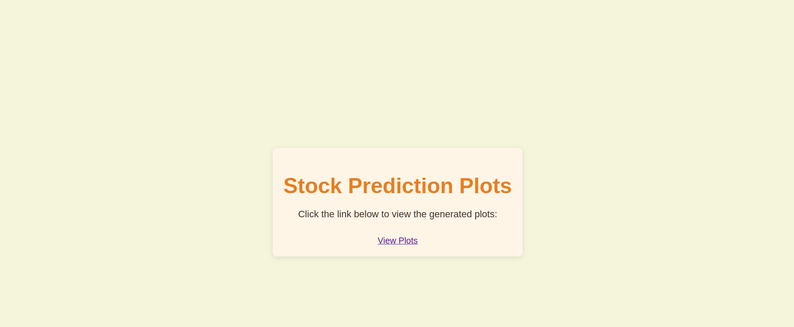

# Stock Price Forecasting

## Project Overview

This project is a comprehensive guide to building a machine learning model using Facebook Prophet to forecast the price of Tesla stock for the next 30 days. Additionally, the performance of the model will be evaluated against real data fetched.

## Key Features

- **Facebook Prophet Model**: Build and train a machine learning model to forecast Tesla stock prices 30 days into the future.
- **Visualization**: Use Plotly Express to create interactive graphs and charts that display Tesla's historical stock performance.
- **Model Evaluation**: Compare the model's forecast against real-time data from Google Finance to evaluate its accuracy.
- **Stock Analysis**: Analyze Tesla's stock using important financial metrics like P/E ratio, EPS, Beta, Market Cap, Volume, and Price Range.
- **Automation**: Learn how to automate the forecasting process to quickly generate predictions and visualizations for any stock of your choice.

## Technologies Used

- **Python**: The core programming language used in this project.
- **Facebook Prophet**: A powerful library for time series forecasting.
- **Plotly Express**: A visualization library used to create interactive plots and graphs.
- **Pandas**: For data manipulation and analysis.
- **Jupyter Notebook**: The development environment used to write and run the code.

## Home Page Preview

